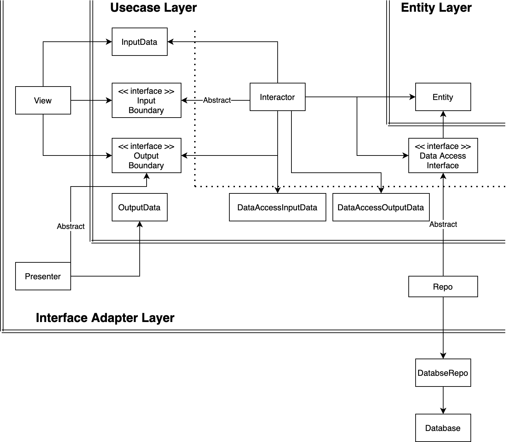

# Clean Architecture with Django
## Description
 This Project implemented it based on Uncle Bob Martin's Clean Architecture book. Also written in python & django.  
 This simple app stores the data of the IoT sensor and sends the stored data as a response.  
 Reports app of project does all the functions described. This app consists of domainlayer, datalayer, and presentationlayer. also, You can try calling the API through the written django test code in project.

  <figure>
   
   <figcaption>Figure 1. Architecture Layers (https://proandroiddev.com/clean-architecture-data-flow-dependency-rule-615ffdd79e29) </figcaption>
  </figure>

## Project Diagram
<figure>
  
  <figcaption>Figure 2. Project Diagram</figcaption>
</figure>  
  


## APIs
```GET``` reports/  
```POST``` reports/


## Reference
- [Clean Architecture Guide (with tested examples): Data Flow != Dependency Rule](https://proandroiddev.com/clean-architecture-data-flow-dependency-rule-615ffdd79e29)
- [Clean Architecture with Spring Boot](https://www.baeldung.com/spring-boot-clean-architecture)
- [Clean Architecture in Django](https://medium.com/21buttons-tech/clean-architecture-in-django-d326a4ab86a9)
- [Clean Architecture in Python](https://velog.io/@jahoy/Python%EC%9C%BC%EB%A1%9C-Clean-Architecture-%EC%A0%81%EC%9A%A9%ED%95%98%EA%B8%B0)
- [Clean Architecture in Flask](https://dailyheumsi.tistory.com/240)
